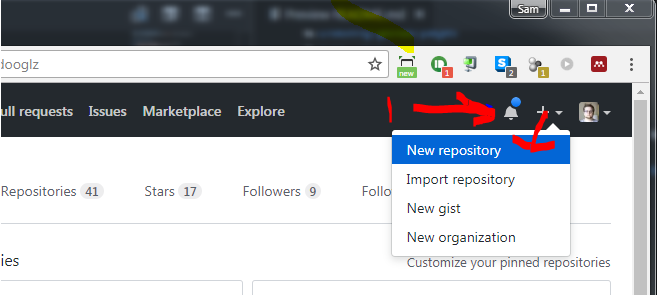
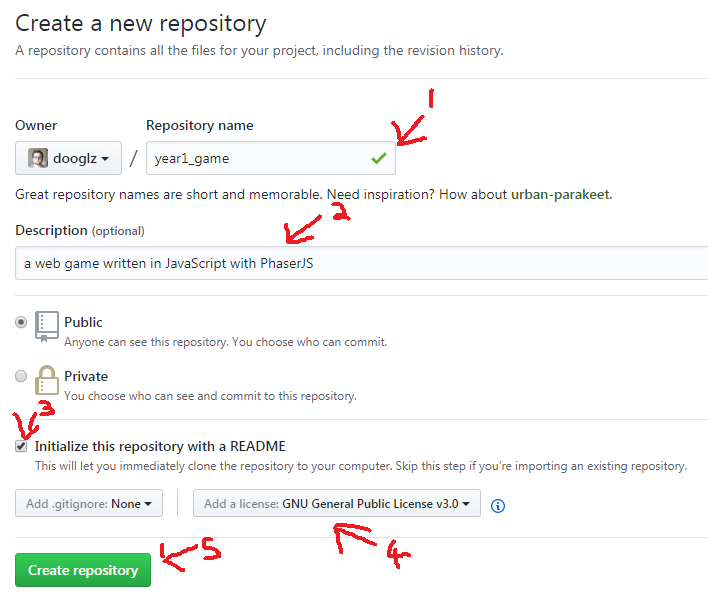
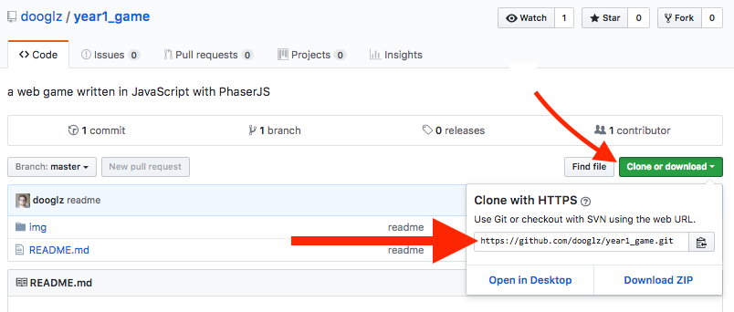
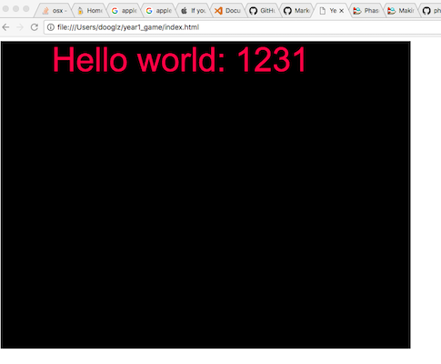
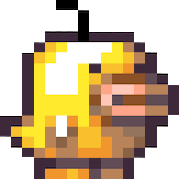
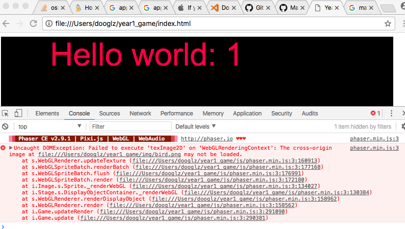
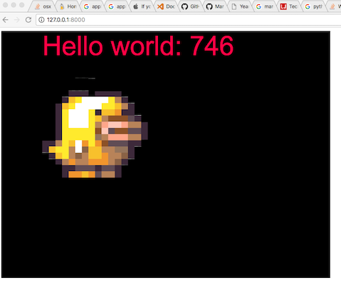
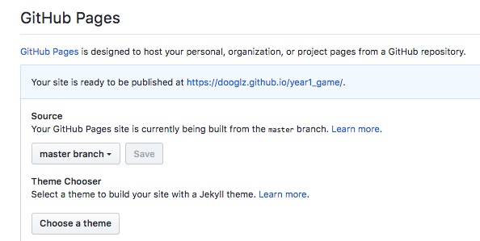

# Year 1 Game side-Project
Build a simple Web Game using [PhaserJs](https://phaser.io/)


## Getting started

1. [Create a Github Repo for your project](#s1)
0. [Clone your repo](#s2)
0. [Add PhaserJS source files](#s3)
0. [Step 4 - Create a simple html page](#s4)
0. [Running a simple webserver](#s5)
0. [Pushing to your repo](#s6)
0. [Enabling github pages](#s7)
0. [Add collaborators](#s8)

---
### Step 1 - Create a Github Repo for your project<a name="s1"></a>

If you have not already created a github account, create one and sign in.

(As a student you get some cool swag from github: [check it out](https://education.github.com/pack))




Give your repo a simple name and descriptive description

Check - Initialize with a readme

Choose an open source license, so people cant legally steal your work without crediting you. The inbuilt guide from github covers this neatly, when in doubt: choose MIT license.

After this stage Github will create the repo for you and you should see something like the following image, now it's time to **clone** the repo down so you can start to work within it. Click the green clone button and copy the link within the box



---
### Step 2 - Clone your repo<a name="s2"></a>

If you haven't installed Git on your pc yet, [do so now](https://git-scm.com/downloads)

Open a cmd (or git-bash) window somewhere (desktop is best). Now clone your repo down
```bash
git clone https://github.com/you/year1_game
```
This will create a folder named year1_game (or whatever you called you repo). Let's move into that folder in the terminal
```bash
cd year1_game
```
Now if you run
```bash
git status
```
you should see something similar to 
```bash
On branch master
Your branch is up-to-date with 'origin/master'.
nothing to commit, working tree clean
```
Now we can Start to get to work properly.

---
### Step 3 - Add PhaserJS source files<a name="s3"></a>
You can integrate phaser into a project in 2 ways
1. Link to the phaser code, hosted on the web.
    This way you don't have the phaser code in your repo, but if you ever want to work offline or the phaser site goes down, your game will break. Whenever a browser goes to your game page it will fetch the phaser code from the phaser webserver.

0. Download the phaser code manually, add it into your repo.
    This means you've always got the phaser library code for use. Downside is that it makes your repo bigger, and you're locked to that version until you update it yourself.

We're going to go with option 2. Navigate yourself to the phaser downloads site: https://phaser.io/download/stable

From here you want to download the "**min.js**" file, and save it in your game folder, under a new folder called "js".

---
### Step 4 - Create a simple html page<a name="s34"></a>
All websites start with html, so let's get to writing some

**Create a file named "index.html"** in your game folder

```html
<!doctype html> 
<html lang="en"> 
<head> 
	<meta charset="UTF-8" />
	<title>Year 1 Game</title>
	<script type="text/javascript" src="js/phaser.min.js"></script>
</head>
<body>
    <script type="text/javascript" src="js/game.js"></script>
</body>
</html>
```
This is as bare-bones as we can get away with HTML, most of the above is standard boilerplate, but there are two lines that do interest us.
```html
<script type="text/javascript" src="js/phaser.min.js"></script>
```
This line loads in the phaser library that we downloaded earlier.

```html
<script type="text/javascript" src="js/game.js"></script>
```
This line loads in the javascript file which we will use for our game code.
If we tried to open this html page in a web browser we would get an error, as we must create this file first.

**Create a file named "game.js"** in your game/js folder. Add the following code.

```javascript
var game = new Phaser.Game(800, 600, Phaser.AUTO, '', { preload: preload, create: create, update: update });

var score = 0;
var text;

function preload() {
}

function create() {
    var style = { font: "65px Arial", fill: "#ff0044", align: "center" };
    text = game.add.text(game.world.centerX-300, 0, "", style);
}

function update() {
    score++;
    text.text = "Hello world: " + score;
}
```

With this last bit of code added, we should have a functional 'game'.
Open index.html in a web browser and you should see something like this:



If you are having any trouble upto this point. the developer console should be your first stop. F12 usually opens this in most web browsers. Have a look there for any errors.

---
### Step 5 - Running a simple webserver<a name="s5"></a>
So far we have a very basic 'game' running in javascript, we can view it by opening the index.html file in a web browser. We are able to do this so far because we haven't loaded in any 'art' assets yet. Once we do, we hit an unfortunate snag with web development. "Cross-origin security (CoRs)". Modern browsers won't let your javascript code load things from weird or unsafe locations. Running your game by just opening it in as a file and then trying to load an image from the folder counts as 'weird'. to get around this we have to server our files from a web server.

First of all let's add an image to see this happening. Download this one:

[)](img/bird.png)

Save it to **img/bird.png**

Now edit game.js to load this image. Add the following two lines
```javascript
function preload() {
    game.load.image('bird', 'img/bird.png');
}

function create() {
//...
    var image = game.add.sprite(100, 100, 'bird');
}
```
If you refresh your game in a browser, you likely won't see anything. Take a look in the dev console:



Dang. Cross-origin errors. Chrome won't load that stupid bird.

### Running a webserver.
The phaser Docs list some good pointers to getting a webserver running.

https://phaser.io/tutorials/getting-started/part2

I would **NOT** recommend installing Apache or WAMP. This would be overkill for what we need. The built in webserver in NodeJS or Python would do us just fine, and if you don't already have they installed on your system, they are super useful environments to have around.

NodeJS
```bash
#globally install the node http-server module
npm install http-server -g
#then from your game directory run:
http-server .
```
Python 2
```bash
python -m SimpleHTTPServer
```
Python 3
```bash
python3 -m http.server
```

Running any of the above commands will start a webserver, serving file out of your game directory.

Navigate your browser to the address shown in the console window. i.e __http://127.0.0.1:8000__.



That's more like it! We can edit the files like normal, and refresh it like normal in the browser. The only difference here is the browser is now satisfied all the data is commIng from a sane source, it trusts the webserver.

---
### Step 6 - Pushing to your repo<a name="s6"></a>

```bash
#See what's changed
git status
#Add all new files
git add *
#Commit changes
git commit -m "finished sam's tutorial"
#Push to github
git push origin
```

---
### Step 7 - Enabling github pages<a name="s7"></a>
On the repo page on github, go into the repository setting and scroll down to the 'Pages' section


Enable pages on your master branch.
Save, and this page should now display something like:


>_Your site is ready to be published at_ https://dooglz.github.io/year1_game/

Github is now serving your repo files as webserver. You can go to the link provided and see your game, live! on the _internet_! Send the link to your friends and family! This will ofcourse only update when you push code to the repo.


---
### Step 8 - Add collaborators<a name="s8"></a>

In your repo setting on github, find the collaborators section. Here you can allow other github users access to read and write to your repo. Now you can work in teams! Jolly Cooperation!


